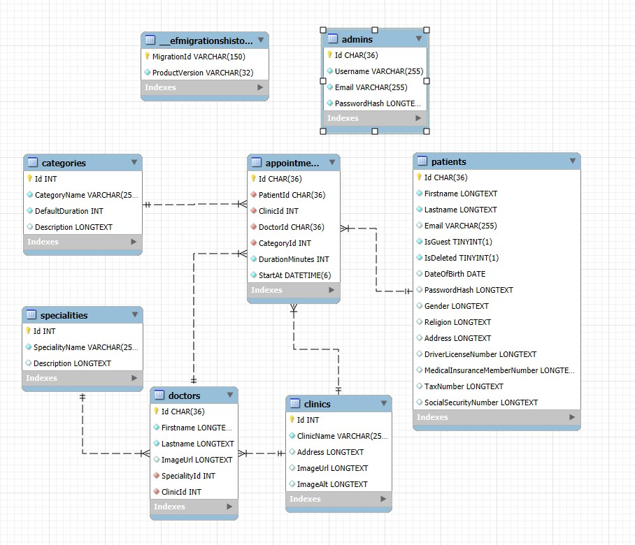

# Noroff- Back-end Development Year 2

# Exam Project 2

# Table of Contents

- [Endpoints](#endpoints)
- [References](#references)
- [Backend](#backend)
  - [Technologies](#technologies)
  - [Setup Instructions](#setup-instructions)
  - [ERD](#erd)
  - [PROJECT LOGIC & ARCHITECTURE](#project-logic--architecture)
- [Frontend](#frontend)
  - [Tech stack](#tech-stack)
  - [Features](#features)
  - [Requirements](#requirements)
  - [Environment variables](#environment-variables)

## ENDPOINTS

### Auth

| Method | Path                | Description                                                                       | Access |
| :----- | :------------------ | :-------------------------------------------------------------------------------- | :----- |
| POST   | `/auth/login`       | Authenticates a user and returns a JWT token                                      | Public |
| POST   | `/auth/register`    | Registers a new patient account, or converts a guest profile to a patient account | Public |
| POST   | `/auth/admin/login` | Authenticates administrative staff                                                | Public |

### Patients

| Method | Path                        | Description                                        | Access        |
| :----- | :-------------------------- | :------------------------------------------------- | :------------ |
| GET    | `/patients`                 | Retrieves a paged list of active patients          | Admin         |
| GET    | `/patients/{id}`            | Retrieves a specific patient profile by ID         | Admin / Owner |
| POST   | `/patients`                 | Allow admin to create basic guest profiles         | Admin         |
| POST   | `/patients/change-password` | Securely updates the authenticated user's password | Patient       |
| PATCH  | `/patients/{id}`            | Partially updates a patient's profile              | Admin / Owner |
| DELETE | `/patients/{id}`            | Permanently deletes a patient record               | Admin         |
| DELETE | `/patients/anonymize/{id}`  | Anonymizes a patient's profile (soft delete)       | Admin         |

### Appointments

| Method | Path                         | Description                                                         | Access        |
| :----- | :--------------------------- | :------------------------------------------------------------------ | :------------ |
| GET    | `/appointments`              | Retrieves a paged and filtered list of all appointments             | Admin         |
| GET    | `/appointments/me`           | Retrieves a paged list of the authenticated patient's appointments  | Patient       |
| GET    | `/appointments/{id}`         | Retrieves details for a specific appointment                        | Admin / Owner |
| GET    | `/appointments/booked-times` | Retrieves a doctor's booked time slots within a specific date range | Public        |
| POST   | `/appointments`              | Books a new appointment                                             | Public        |
| PATCH  | `/appointments/{id}`         | Updates an existing appointment's schedule or doctor                | Admin / Owner |
| DELETE | `/appointments/{id}`         | Cancels and deletes a specific appointment                          | Admin / Owner |

### Doctors

| Method | Path              | Description                                                    | Access |
| :----- | :---------------- | :------------------------------------------------------------- | :----- |
| GET    | `/doctors`        | Retrieves a paged list of doctors for the public directory     | Public |
| GET    | `/doctors/search` | Searches for doctors using name-based tokenization and filters | Public |
| GET    | `/doctors/{id}`   | Retrieves detailed profile information for a doctor            | Public |
| POST   | `/doctors`        | Registers a new doctor into the system                         | Admin  |
| PATCH  | `/doctors/{id}`   | Updates an existing doctor's profile                           | Admin  |
| DELETE | `/doctors/{id}`   | Removes a doctor from the directory                            | Admin  |

### Clinics

| Method | Path            | Description                          | Access |
| :----- | :-------------- | :----------------------------------- | :----- |
| GET    | `/clinics`      | Retrieves all clinics                | Public |
| GET    | `/clinics/{id}` | Retrieves a clinic by ID             | Public |
| POST   | `/clinics`      | Creates a new clinic into the system | Admin  |
| PATCH  | `/clinics/{id}` | Partially updates a clinic profile   | Admin  |
| DELETE | `/clinics/{id}` | Deletes a clinic                     | Admin  |

### Categories

| Method | Path               | Description                                      | Access |
| :----- | :----------------- | :----------------------------------------------- | :----- |
| GET    | `/categories`      | Retrieves a paged list of appointment categories | Public |
| GET    | `/categories/{id}` | Retrieves a specific appointment category        | Public |
| POST   | `/categories`      | Creates a new appointment category               | Admin  |
| PATCH  | `/categories/{id}` | Partially updates an appointment category        | Admin  |
| DELETE | `/categories/{id}` | Deletes an appointment category                  | Admin  |

### Specialities

| Method | Path                 | Description                                        | Access |
| :----- | :------------------- | :------------------------------------------------- | :----- |
| GET    | `/specialities`      | Retrieves a paged list of all medical specialities | Public |
| GET    | `/specialities/{id}` | Retrieves a specific speciality by ID              | Public |
| POST   | `/specialities`      | Creates a new medical speciality                   | Admin  |
| PATCH  | `/specialities/{id}` | Updates a speciality                               | Admin  |
| DELETE | `/specialities/{id}` | Deletes a speciality                               | Admin  |

### Admins

| Method | Path           | Description                                                   | Access |
| :----- | :------------- | :------------------------------------------------------------ | :----- |
| GET    | `/admins`      | Retrieves a paged list of all administrative accounts         | Admin  |
| GET    | `/admins/{id}` | Retrieves a specific admin profile by ID                      | Admin  |
| POST   | `/admins`      | Registers a new administrative user with hashed credentials   | Admin  |
| PATCH  | `/admins/{id}` | Partially updates admin info (Username, Email, or Password)   | Admin  |
| DELETE | `/admins/{id}` | Deletes an admin; denied if deleting the last remaining admin | Admin  |

**Full Documentation**: Available at `/doc` (Swagger) when running locally.

## REFERENCES

### Identity & Security

- JWT Architecture: [A Comprehensive Guide to JWT Authentication in .NET Core](https://medium.com/@emreemenekse/a-comprehensive-guide-to-jwt-authentication-in-net-core-8e2d8859b1be)
- Claim Mapping Fixes: Addressed the issue where sub claims were automatically mapped to nameidentifier by Microsoft's middleware.
  - [StackOverflow: JWT Auth changes claims sub](https://stackoverflow.com/questions/62475109/asp-net-core-jwt-authentication-changes-claims-sub)
  - [StackOverflow: HttpContext User Claims mismatch](https://stackoverflow.com/questions/68252520/httpcontext-user-claims-doesnt-match-jwt-token-sub-changes-to-nameidentifie/68253821#68253821)

### API Infrastructure (.NET 10)

- OpenAPI & Swagger Workarounds: Navigated the instability of .NET 10's native document generators by implementing a custom IOperationFilter and manual security definitions.
  - [StackOverflow: Authentication not working in Swagger with .NET 10](https://stackoverflow.com/questions/79834574/authentication-not-working-in-swagger-with-net-10)
  - [GitHub: ASP.NET Core Issues - SwaggerGen](https://github.com/dotnet/aspnetcore/issues/64524)
  - [GitHub: Swashbuckle - Configure and Customize SwaggerGen](https://github.com/domaindrivendev/Swashbuckle.AspNetCore/blob/master/docs/configure-and-customize-swaggergen.md#add-security-definitions-and-requirements-for-bearer-authentication)
  - An unhealthy dose of watching AIs run around in circles trying to solve the problem, and then piecing together the correct solution from their various attempts and the linked resources.
- Seeding Data in ASP.NET Core: Implemented a robust seeding mechanism to populate the database with test data for development and testing purposes.
  - [Medium: Data Seeding in ASP.NET Core - The Right Way](https://medium.com/@samsondavidoff/data-seeding-in-asp-net-core-the-right-way-4c7c1f4b1773)
- Error handling best practices and guides:
  - [Functional Error Handling in .NET with the Result Pattern](https://www.milanjovanovic.tech/blog/functional-error-handling-in-dotnet-with-the-result-pattern)
  - [Handling Web API Exceptions with ProblemDetails Middleware](https://andrewlock.net/handling-web-api-exceptions-with-problemdetails-middleware/)
- Validation:
  - [FluentValidation Integration with ASP.NET Core](https://docs.fluentvalidation.net/en/latest/aspnet.html)
- Database Persistence: Strategies for UTC storage and timezone-aware retrieval.
  - [Tinybird Blog: Database Timestamps & Timezones](https://www.tinybird.co/blog/database-timestamps-timezones)
  - Gemini, ChatGTP were both helpful and a hindrance in implementing this correctly after the initial implementation had issues with timezone offsets and date mismatches between the frontend and backend.

### Frontend Implementation and UI:

- Dealing with dates and timezones in JavaScript and React:
  - [date-fns Library](https://date-fns.org/)
  - [date-fns-tz GitHub](https://github.com/marnusw/date-fns-tz#readme)
- Image error handling
  - [Broken Images in React](https://dev.to/eidellev/handling-broken-images-in-react-4oo2)
- [Heart rate animation](https://github.com/Hona-08/Heart-rate-monitor-Pure-CSS-Animation)
- API handler for frontend
  - [Fetch Wrapper for Next.js: A Deep Dive into Best Practices](https://dev.to/dmitrevnik/fetch-wrapper-for-nextjs-a-deep-dive-into-best-practices-53dh)

### Docs and general implementation:

- [.NET 10 (ASP.NET Core)](https://learn.microsoft.com/en-us/aspnet/core/introduction-to-aspnet-core?view=aspnetcore-10.0)
- [Entity Framework Core](https://learn.microsoft.com/en-us/ef/core/)
- [Next.js 16](https://nextjs.org/blog/next-16)
- [Tailwind CSS](https://tailwindcss.com/)
- [Zustand](https://zustand-demo.pmnd.rs/)
- [React Hook Form](https://react-hook-form.com/)
- [Zod](https://zod.dev/)
- [react-day-picker](https://react-day-picker.js.org/)
- [date-fns](https://date-fns.org/)
- [date-fns-tz](https://github.com/marnusw/date-fns-tz#readme)

# Backend

A .NET 10 Web API. This was built and run using version 10.0.100 of the .NET SDK.

### Technologies

- **Runtime**: .NET 10
- **ORM**: Entity Framework Core with MySQL
- **Validation**: FluentValidation
- **Documentation**: Swagger/OpenAPI

## Setup Instructions

1. Clone the repository and navigate to the backend directory.

2. Using the `appsettings.example.json` file as a template, create your own `appsettings.json` file in the root of the project and add your own values.

```json
{
  "JwtSettings": {
    "SecretKey": " MySecretKey",
    "Issuer": "MyIssuer",
    "Audience": "MyAudience",
    "ExpiryMinutes": 600
  },
  "Logging": {
    "LogLevel": {
      "Default": "Information",
      "Microsoft.AspNetCore": "Warning"
    }
  },
  "AdminSettings": {
    "DefaultUsername": "admin",
    "DefaultEmail": "admin@clinic.com",
    "DefaultPassword": "ChangeMe123!"
  },
  "AllowedHosts": "*",
  "ConnectionStrings": {
    "DefaultConnection": "server=localhost;database=exam_project_2;user=root;password=password123"
  }
}
```

4. Ensure you have a MySQL server running and details of your created database are correctly set in the `appsettings.json` file. This should match the ConnectionStrings:DefaultConnection value.

```json
"ConnectionStrings": {
    "DefaultConnection": "server=localhost;database=dev_house;user=root;password=superSecurePassword"
  }
```

5. Opening a terminal in the backend directory, install the required dependencies using the .NET CLI:

```bash
dotnet restore
```

6. Apply database migrations to set up the database schema:

```bash
dotnet ef database update
```

If you don't have the EF tools installed, you can do so with:

```bash
dotnet tool install --global dotnet-ef
```

If the migrations are not present, you can create them using:

```bash
dotnet ef migrations add Initial
```

Then run the update command again:

```bash
dotnet ef database update
```

7. The application includes a seeding mechanism to populate the database with test data for better frontend development and testing. You can run the seeding process with the following command:

```bash
dotnet run -- --seed
```

8. Finally, start the server with:

```bash
dotnet run
```

9. The API is currently configured to run on `https://localhost:7071` and the Swagger documentation is available at `https://localhost:7071/doc` when running locally.

## ERD



## Project Logic & Architecture

### Data Privacy (PII)

- Guest users store a minimal subset of personal data required to create and manage an appointment. This includes Firstname, Lastname, Email, and DateOfBirth.
- Sensitive identifiers (such as social security numbers, insurance identifiers, and authentication credentials) are restricted to registered patients only.
- Email is required for guest bookings to allow appointment communication and to reduce duplicate or abusive bookings.

In a production system, email verification could be used to confirm ownership before converting a guest patient into a registered account.

### Appointment Constraints

The system enforces several constraints to ensure valid appointment scheduling:

- Appointment booking times must be divided into 5-minute increments, eg. 8:00, 8:05, 8:10, etc. This is validated on the backend and rejected if not met.
- The API allows for booking anytime, the frontend has environment variables to configure the visible booking hours and slot intervals. No requirement was given to enforce this, it was done purely for user experience frontend side, but the backend will accept any valid time as long as it meets the 5-minute increment rule.
- Appointments cannot be booked in the past, and the API validates this to prevent scheduling errors.
- Each appointment must be associated with a valid patient, doctor, category, and clinic, ensuring data integrity and proper scheduling. I didn't get clinic based on doctor, as potentially a doctor could change clinics in the future. I only enforce based on the doctors current clinic at the time of booking, and allow for changing the clinic later if needed, but have enforced that a doctor have no future appointments when changing clinics to prevent scheduling conflicts.

### The "Date" Challenge

Handling timezones across a MySQL database and a React frontend was a significant focus. All dates are synchronized using UTC to prevent scheduling offsets between the client and the server. After getting this correct I didn't attempt to enforce clinic opening hours server side as that could get messy with timezone conversions and the frontend already has configuration for this, so I left it as a user experience feature on the frontend to only show available slots within the configured hours, but the backend will accept any valid time as long as it meets the 5-minute increment rule and is not in the past.

# Frontend

Next.js frontend for the Clinic Hub booking system.  
Consumes the REST API and provides public booking, patient login, and basic directory/lookup UI.

### Tech stack

- Next.js 16 (App Router)
- React 19
- TypeScript
- Tailwind CSS
- Zustand (auth/session state)
- React Hook Form + Zod (form handling + validation)
- date-fns + date-fns-tz (date/time handling)
- react-day-picker (calendar UI)

### Features

The frontend provides the following functionality:

- Public appointment booking
- Guest patient booking flow
- Calendar-based slot selection, with dynamic generation based on backend availability and configured booking hours
- Patient login and registration
- Patient appointment overview, cancellation, and rescheduling
- Doctor directory, filters by specialty/clinic, and search by doctor name
- Clinic lookup, with details page showing associated doctors at location

Authentication state is managed using Zustand and persisted locally to maintain session state between refreshes.

An admin dashboard is also included, but not linked in the UI, as it was not a requirement. It can be accessed at `/admin` and provides basic CRUD interfaces for managing doctors, clinics, categories, and appointments.

### Requirements

- Node.js (LTS recommended)
- Running backend API (ASP.NET Core) on HTTPS

### Environment variables

Create a `.env` file in the frontend root:

```bash
# API url
NEXT_PUBLIC_API_BASE_URL=https://localhost:7071
NEXT_PUBLIC_TIMEZONE=Europe/Oslo

# Booking slot configuration
#(minutes, increments of 5 recommended, API rejects based on %5 validation )
NEXT_PUBLIC_APPOINTMENT_INTERVAL=15
#(hours, whole numbers, 24h format, haven't supported decimal hours yet)
NEXT_PUBLIC_APPOINTMENT_START=8
NEXT_PUBLIC_APPOINTMENT_END=16
```

### Notes

- `NEXT_PUBLIC_API_BASE_URL` must match the backend HTTPS URL.
- Time values are used for booking slot generation on the client.
- If you change backend ports, update the env value accordingly.
- Timezone handling: Frontend uses `NEXT_PUBLIC_TIMEZONE=Europe/Oslo` together with date-fns-tz to present times consistently to Norwegian users while sending appointment timestamps to the API in ISO format (UTC).

### Install & Run

```bash
# Install dependencies
npm install
# Run development server
npm run dev
```

Open `http://localhost:3000` in your browser to access the frontend.
